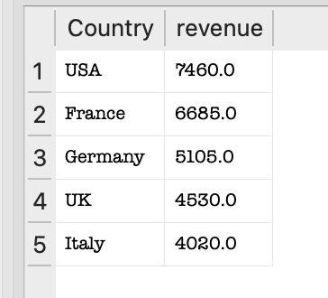
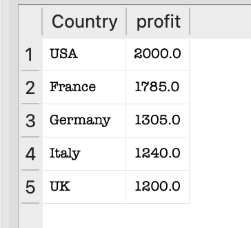
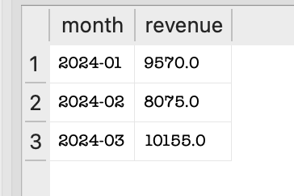
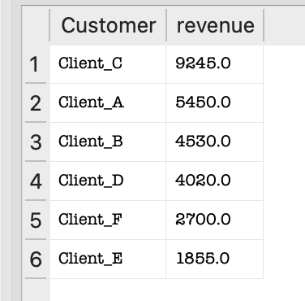
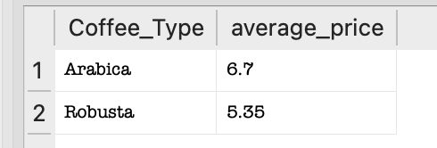

# Coffee Sales SQL Analysis

## Overview
This project analyzes coffee sales data using SQL in SQLite. It focuses on revenue, profit, customer performance, product performance, and monthly business trends.

## Objectives
- Calculate revenue and profit directly in SQL
- Analyze performance by country, customer, and coffee type
- Track monthly revenue and profit trends
- Practice SQL queries used in data analyst roles

## Tools Used
- SQLite
- DB Browser for SQLite
- SQL

## Dataset
The dataset contains coffee trading transactions with the following fields:
- Date
- Country
- Customer
- Coffee_Type
- Quantity_kg
- Price_per_kg
- Cost_per_kg
- Shipping_Cost

## Analysis Performed
- Total quantity sold
- Total revenue
- Total profit
- Revenue by country
- Profit by country
- Revenue by coffee type
- Profit by coffee type
- Monthly revenue trend
- Monthly profit trend
- Top customers by revenue
- Top customers by profit
- Average selling price by coffee type
- Lowest-performing countries by profit

## SQL Skills Demonstrated
- SELECT
- SUM()
- AVG()
- GROUP BY
- ORDER BY
- AS aliases
- Calculated metrics in SQL
- Time-based grouping with `strftime()`

## Files
- `coffee_sales.db` — SQLite database
- `queries.sql` — SQL queries used for analysis
- `data/coffee_sales.csv` — source dataset

## How to Use
1. Open `coffee_sales.db` in DB Browser for SQLite
2. Open `queries.sql`
3. Run the queries in the Execute SQL tab

## Key Insights
- Revenue and profit vary by country
- High sales do not always mean high profit
- Coffee types differ in profitability
- Monthly SQL analysis helps track business performance over time

## Future Improvements
- Add SQL joins with additional tables such as suppliers or shipments
- Expand the dataset with more transactions
- Build a Power BI dashboard using the same data

## Sample Query Outputs

### Revenue by Country

### Profit by Country

### Monthly Revenue

### Top Customers

### Average price
